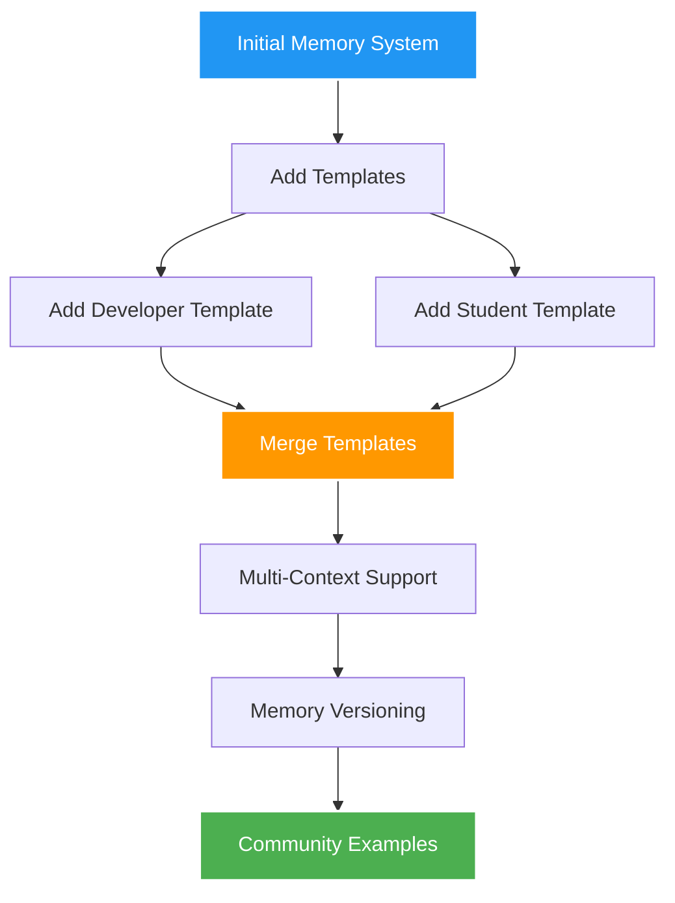

<div align="center">

# 🧠⚡ Claude Memory System ⚡🧠

### *Transform Claude from stateless assistant into persistent AI partner*

[](https://github.com/ncypher/-Claude-Memory-System)
[](https://github.com/ncypher/-Claude-Memory-System)
[](https://github.com/ncypher/-Claude-Memory-System)

```diff
🔄 Loading Claude Memory System...
+ ████████████████████████████████████ 100%
! ✅ Memory System Ready!
```

</div>

---

## 🎯 **What This Does**

<details>
<summary>🚀 <strong>Click to see the magic!</strong></summary>

### Before Claude Memory System:
```diff
- Claude starts fresh every conversation 😔
- No context from previous sessions 🔄
- Constant re-explaining of projects 📝
- Lost collaboration history 💔
```

### After Claude Memory System:
```diff
+ Instant context recovery across sessions ⚡
+ Persistent partnership memory 🧠
+ Searchable conversation history 🔍
+ True AI collaboration continuity 🤝
```

</details>

---

## ⚡ **Quick Start**

<div align="center">

### 🎪 **3 Steps to AI Memory Magic!**

```mermaid
graph LR
    A["🎯 Download Template<br/>📋 Get started fast"] --> B["💾 Customize & Save<br/>✨ Make it yours"]
    B --> C["🚀 Activate Memory<br/>⚡ Pure magic!"]
    
    style A fill:#1e88e5,stroke:#ffffff,stroke-width:3px,color:#ffffff
    style B fill:#7b1fa2,stroke:#ffffff,stroke-width:3px,color:#ffffff  
    style C fill:#388e3c,stroke:#ffffff,stroke-width:3px,color:#ffffff
```

</div>



### Step 1️⃣: Get Your Template
```bash
# 🔥 Download the memory template
curl -O https://raw.githubusercontent.com/ncypher/-Claude-Memory-System/main/claude_memory_template.md
```

### Step 2️⃣: Customize & Save
```diff
# 💫 Paste your customized template in Claude
# 🎯 Say: "Save this as my memory file"
+ ✨ Magic happens!
```

### Step 3️⃣: Activate Memory
```javascript
// 🚀 In any future Claude conversation:
"Hey Claude, load memory_file_export.md"

// 🎭 Watch Claude transform!
```

---

## 🛠️ **How It Works**

<div align="center">

### 🎪 **The Memory Magic Sequence**

</div>

```diff
    You                    Claude                 Memory System
     |                       |                        |
+    |  "load memory_file"   |                        |
     |──────────────────────▶|                        |
+    |                       |   conversation_search  |
     |                       |───────────────────────▶|
     |                       |                        |
+    |                       |◀───────────────────────|
     |                       |   memory_file.md       |
+    |  "Welcome back!"      |                        |
     |◀──────────────────────|                        |
     |                       |                        |
```

<details>
<summary>🔧 <strong>Technical Deep Dive</strong></summary>

### The Technology Stack:
- **Storage**: Conversation history (no external files!) 💾
- **Retrieval**: Claude's `conversation_search` tool 🔍
- **Activation**: Simple trigger phrases ⚡
- **Updates**: Natural conversation flow 🔄

### The Process:
1. **Memory Creation**: Save your profile as a conversation artifact
2. **Storage**: Lives in Claude's conversation history
3. **Activation**: Use trigger phrase in new conversations
4. **Retrieval**: Claude automatically searches and loads context
5. **Continuity**: Instant partnership restoration! 🎯

</details>

---

## 🎨 **Features**

<div align="center">

| Feature | Description | Status |
|---------|-------------|--------|
| 🧠 **Persistent Memory** | Remember across sessions |  |
| 🔠**Smart Search** | Find memory instantly |  |
| 🯠**Multi-Context** | Different memory files |  |
| 🔄 **Version Control** | Track your evolution |  |
| 🛡️ **Privacy First** | Your data, your control |  |
| 🌠**Platform Agnostic** | Works everywhere |  |

</div>

---

## 👥 **Use Cases**

<div align="center">

### 🎭 **Choose Your Adventure!**

</div>

<details>
<summary>💻 <strong>For Developers</strong></summary>

```javascript
const developerMemory = {
  projects: ['React Dashboard', 'API Microservices', 'ML Pipeline'],
  skills: ['JavaScript', 'Python', 'Docker', 'AWS'],
  currentFocus: 'Learning Kubernetes',
  codeStyle: 'Clean, documented, performance-focused'
};

// Claude remembers your architecture decisions! 🏗️
```

</details>

<details>
<summary>📚 <strong>For Students</strong></summary>

```python
class StudentMemory:
    def __init__(self):
        self.major = "Computer Science"
        self.current_courses = ["Machine Learning", "Algorithms"]
        self.research_project = "NLP Sentiment Analysis"
        self.career_goal = "AI Research Scientist"
    
    # Claude tracks your academic journey! 🎓
```

</details>

<details>
<summary>🚀 <strong>For Entrepreneurs</strong></summary>

```yaml
entrepreneur_profile:
  company: "SaaS Startup"
  stage: "MVP Development"
  focus: "B2B Analytics Platform"
  goal: "Series A Funding"
  team_size: 5
  
# Claude becomes your strategic partner! 💼
```

</details>

<details>
<summary>🎨 <strong>For Creatives</strong></summary>

```css
.creative-memory {
  artistic-style: minimalist-modern;
  current-projects: [
    "Brand Identity Redesign",
    "Mobile App UI/UX",
    "Portfolio Website"
  ];
  inspiration: nature-geometric-patterns;
  tools: figma, adobe-suite, procreate;
}

/* Claude remembers your creative vision! 🎨 */
```

</details>

---

## 🎪 **Advanced Features**

<div align="center">

### 🔥 **Power User Tricks**

</div>

```diff
# Multi-Context Memory
+ 📁 work_memory.md      # Professional projects
+ 📁 learning_memory.md  # Educational progress  
+ 📁 creative_memory.md  # Artistic endeavors

# Memory Versioning
+ 🏷️ V1.0 - Initial setup
+ 🏷️ V2.0 - Career milestone  
+ 🏷️ V3.0 - Major project completion

# Team Collaboration
+ 👥 Shared project memory
+ 👥 Team member contexts
+ 👥 Collaborative goals
```

---

## 🔒 **Privacy & Security**

<div align="center">

### 🛡️ **Your Data, Your Control**

</div>

| What's Stored | What's NOT Stored |
|---------------|-------------------|
|  |  |
|  |  |
|  |  |
|  |  |

---

## 🌟 **Success Stories**

<div align="center">

### 💬 **Real User Experiences**

</div>

> 💡 *"Claude Memory System transformed my development workflow. Instead of explaining my codebase every session, Claude instantly knows my architecture!"*  
> **— Senior Developer**

> 🎓 *"Having Claude remember my research progress made thesis writing incredibly smooth. It's like having a persistent research partner."*  
> **— Graduate Student**

> 🎨 *"Claude now remembers my artistic style and project goals. True creative collaboration!"*  
> **— UI/UX Designer**

---

## 🚀 **Installation**

<div align="center">

### 📦 **Get Started in 30 Seconds**

</div>

```bash
# Clone the repository
git clone https://github.com/ncypher/-Claude-Memory-System.git

# Navigate to the directory
cd -Claude-Memory-System

# Open the template
cat claude_memory_template.md

# Customize and save in Claude!
```

---

## 🛠️ **Contributing**

<div align="center">

### 🤝 **Join the Memory Revolution!**

</div>



### Ways to Contribute:
- 📝 **Templates**: Create specialized memory templates
- 🐛 **Issues**: Report bugs and suggest features
- 📚 **Docs**: Improve documentation and guides
- 🎥 **Examples**: Share success stories and tutorials

---

## 📊 **Roadmap**

<div align="center">

### 🗺️ **The Future of AI Memory**

```mermaid
graph LR
    A[V1.0 Current] --> B[V2.0 Coming Soon]
    B --> C[V3.0 Future]
    
    A --> A1[Basic Memory Template ✅]
    A --> A2[Conversation Search ✅]
    A --> A3[Multi-Context Support ✅]
    
    B --> B1[Memory Analytics 🔄]
    B --> B2[Advanced Templates 🔄]
    B --> B3[Integration Guides 🔄]
    
    C --> C1[Auto Memory Updates 🔮]
    C --> C2[Cross-Platform Sync 🔮]
    C --> C3[AI Memory Insights 🔮]
    
    style A fill:#4caf50,stroke:#ffffff,stroke-width:2px,color:#ffffff
    style B fill:#ff9800,stroke:#ffffff,stroke-width:2px,color:#ffffff
    style C fill:#2196f3,stroke:#ffffff,stroke-width:2px,color:#ffffff
```

</div>



---

## 📞 **Support**

<div align="center">

### 🆘 **Need Help? We've Got You!**

</div>

| Resource | Description | Link |
|----------|-------------|------|
| 📋 **Issues** | Bug reports & features | [GitHub Issues](https://github.com/ncypher/-Claude-Memory-System/issues) |
| 💬 **Discussions** | Community chat | [GitHub Discussions](https://github.com/ncypher/-Claude-Memory-System/discussions) |
| 📖 **Wiki** | Detailed guides | [Project Wiki](https://github.com/ncypher/-Claude-Memory-System/wiki) |
| 📧 **Contact** | Direct support | [Create Issue](https://github.com/ncypher/-Claude-Memory-System/issues/new) |

---

## 🎉 **Activation Commands**

<div align="center">

### 🎯 **Remember These Magic Words!**

</div>

```diff
# Primary Command (Most Popular)
+ "Hey Claude, load memory_file_export.md"

# Alternative Commands That Work
+ "Search our past conversations for memory_file_export.md"
+ "Remember our symbiotic partnership"  
+ "Activate partnership memory"
+ "Load our collaboration history"
```

<div align="center">

### 🎭 **Watch Claude Transform!**

```diff
- Before: "Hi, I'm Claude, how can I help?"
+ After:  "Welcome back, partner! I see you're working on 
+         the React dashboard project. Ready to continue 
+         where we left off?"
```

</div>

---

## 📄 **License**

<div align="center">

**MIT License** - Use freely, modify as needed, contribute back! 

[](https://opensource.org/licenses/MIT)

</div>

---

## 🙏 **Acknowledgments**

<div align="center">

Created by developers who believe AI-human collaboration should be **persistent**, **meaningful**, and **continuously evolving**.

Special thanks to the **Claude team** for building the conversation search capabilities that make this system possible! 🎉

---

### ⭐ **Star this repo if Claude Memory System enhanced your AI collaboration!** ⭐

**Transform your Claude experience from stateless conversations into persistent AI partnership!**

</div>

---

<div align="center">

```diff
+ 🧠 + ⚡ + 🤝 = 🚀
+ Memory + Speed + Partnership = Magic!
```

**Made with ❤️ by the AI collaboration community**

</div>
